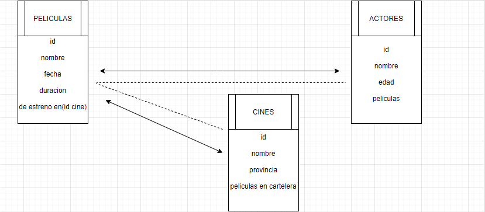

# GeeksHubs-P4---Backend-Movie
Proyecto nro 4 del curso FSDGHA

Para este proyecto nos hemos aventurado en el mundo del backend, creando una api propia
en la que podemos consultar datos acerca una base de datos especifica en la que nosotros
mismos hemos almacenado datos mediante sequelize.

Para el mismo he comenzado aclarando las ideas con las que he de trabajar mediante un esquema grafico.


### Repositorio 🚀

```bash
git clone https://github.com/mrboggii/GeeksHubs-P4---Backend-Movie
```
### Construido con 🛠️

1. Node
2. Express
3. Sequelize
4. SQL
5. GitHub


### Autor ✒️

Ioan Bogdan Prutean  

### Licencia 📄
Licencia (Apache) .
